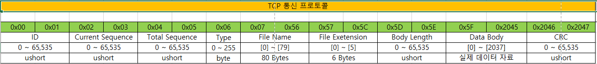
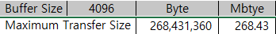

# Ironwall Libraries


### Goal
> Ironwall의 기능을 구현하기 위해서 필요한 다양한 프로젝트를 Library 형태로 구현한 세트로 기존에 개별적으로 관리하던 라이브러리 세트를 일괄적으로 관리하는 Repository로 할당하였음

### Site : Common
### Branch : Ironwall_Basic_Library  
### Last Updated : 2023-05-15

### Versions

* Ironwall.Framework  
* Ironwall.Libraries.Enums  
* Ironwall.Libraries.Utils  
  
* Ironwall.Libraries.Account.Client  
* Ironwall.Libraries.Account.Common  
* Ironwall.Libraries.Account.Server  
* Ironwall.Libraries.Accounts  
  
* Ironwall.Libraries.Client  
* Ironwall.Libraries.Server  
    
* Ironwall.Libraries.Cameras  
* Ironwall.Libraries.Devices  
* Ironwall.Libraries.Events  
* Ironwall.Libraries.Onvif  
* Ironwall.Libraries.RTSP  

* Ironwall.Libraries.Tcp.Client  
* Ironwall.Libraries.Tcp.Server  
* Ironwall.Libraries.Tcp.Packets  
* Ironwall.Libraries.Tcp.Common  
* Ironwall.Libraries.UI.Controls  
* Ironwall.Libraries.VlcRTSP  
* Ironwall.Libraries.WatchDog  

* Ironwall.Libraries.VMS.Common
* Ironwall.Libraries.VMS.UI

<hr>

### Update Date: 2023/01/20

* Ironwall.Libraries.Server   
* Ironwall.Libraries.Account.Server  
* Version : v1.0.1
* Comment
    1) 기존의 TcpServer를 상속받는 구조를 변경하여, AccountServerService로 부터 상속을 받는 구조로 변경해야된다.  
    2) 기존의 TcpServer의 기능을 AccountServerService로 이관한다.   
    3) Session관련 Timer를 분기하여, Tcp 커넥션을 위한 타이머와 나눈다.   
    4) Server또한 TaskTimer를 상속 받기 때문에 Timer가 총 3개가 운영된다. AccountServerService의 SessionTimer, TcpAcceptedClient의 ConnectionTimer, 마지막으로 Server의 ConnectionTimer 가 운영된다.  


* Ironwall.Libraries.Client   
* Ironwall.Libraries.Account.Client  
* Version : v1.0.1
* Comment
    1) 기존의 TcpClient를 상속받는 구조를 변경하여, AccountClientService로 부터 상속을 받는 구조로 변경해야된다.   
    2) 기존의 TcpClient의 기능을 AccountClientService로 이관한다.  
    3) Session관련 Timer를 분기하여, Tcp 커넥션을 위한 타이머와 나눈다.  

<hr>

### Update Date: 2023/01/25
  
* Ironwall.Framework   
* Version : v2.0.1  
* Comment  
    1) Models.Accounts의 내용 분기  
       1) LoginSessionModel : 로그인한 사용자의 세션정보 모델  
       2) LoginUserModel : 로그인한 사용자의 클라이언트 사이드 정보  
       3) UserModel : 사용자의 정보를 구성하는 정보  
    
    2) ViewModels.Accounts의 내용 분기  
       1) LoginSessionViewModel : LoginSessionModel View Notification을 위한 인스턴스  
       2) LoginUserViewModel : LoginUserModel View Notification을 위한 인스턴스   
       3) UserViewModel : UserModel View Notification을 위한 인스턴스  

    3) UserBaseViewModel삭제  
    4) UserBasePanel 삭제  
    5) ViewModels의 ViewFactory 추가  
       1) UserViewModel  
       2) LoginUserViewModel  
       3) LoginSessionViewModel  

* Ironwall.Libraries.UI.Controls   
* Version : v1.0.1  
* Comment  
    1) UCUserProperty.Xaml 추가  
    2) Components에 UCCancelButton.xaml 추가  
    3) Components에 UCUserButtonGroup.xaml 추가  

* Ironwall.Libraries.Account.Common   
* Version : v1.0.1  
* Comment  
    1) Provider 사이드를 Models와 ViewModels로 구분하여 분기  
    2) 기존 Ironwall.Libraries.Events, Ironwall.Libraries.Devices 같은 메커니즘을 차용  
    3) Model의 내용을 이벤트로 연계 후, Refresh, Insert, Update, Delete의 방식으로 Model Provider와 ViewModel Provider를 연동  
    4) 연동 대상  
       1)  LoginProvider - LoginViewModelProvider  
       2)  LoginUserProvider - LoginUserViewModelProvider  
       3)  SessionProvider - SessionViewModelProvider  
       4)  UserProvider - UserViewModelProvider  

<hr>

### Update Date: 2023/01/26

* Ironwall.Framework
* Version : v2.0.2  
* Comment  
    1) ModelFactory Account 관련 모델 추가 (from RequestModel to AccountModel)  

* Ironwall.Libraries.Account.Common   
* Version : v1.0.2  
* Comment  
    1) AccountDbService Interface로 parameter 수정 및 return value로  Interface type으로 변경
    2) 그에 따른 AccountServer 연관하여 변경  

* Ironwall.Libraries.Account.Server   
* Version : v1.0.2  
* Comment  
    1) AccountDbService 변경에 따른 타입 변경 처리 Interface type
    2) 기존에 Provider에 Generic type의 상위 부모타입 IAccountBaseModel로 기본타입 설정된 부분 각 Provider 별로 개별 타입으로 타입 캐스팅

<hr>

### Update Date: 2023/02/17  

* Ironwall.Libraries.Tcp.Common  
* Version : v1.0.2  
* Comment  
    1) Settings.settings 정보 추가  
    2) Models > TcpClientModel, TcpModel, TcpSetupModel 업데이트  
    3) Models > TcpModelFactory 모델별 생성자 추가  
    4) 기존에 HeartBeat Time을 참조하던 SetupModel을 TcpSetupModel로 통일화...  
* Action Items  
    1) Tcp통신에 메시지 통신 뿐만 아니라 File 전송을 위한 프로토콜 설계 및 업데이트가 필요하다. 굉장히 큰 개발 이슈가 될 수 있는 부분이라서 고민이 많이 필요할 것으로 보인다.  
    2) 서버에서 각 클라이언트에 맵 정보 및 맵 오브젝트 정보를 갱신 할 수 있는 기능이 추가되어야 한다. Tcp 통신에 대용량 메시지 전송을 위한 프로토콜 설계 및 업데이트가 필요하다. 

* Ironwall.Libraries.Event.UI  
* Version : v1.0.0  
* Comment  
    1) EventPanel을 위한 View-ViewModel, Logic 등이 추가되었다.  
    2) 현재 Ironwall.Libraries.Events와 Ironwall.Libraries.Event.UI의 경계가 살짝 모호한 부분이 생겨서 추가적인 정리가 필요하다. 목표는  Ironwall.Libraries.Events는 로직적인 부분만 담고, Ironwall.Libraries.Event.UI는 View-ViewModel관련 부분만 구성하는 것이다.  
    3) EventPanel에 EventCard가 PreEventListPanel관 PostEventListPanel에 구현이 되었고, 테스트를 통해서 확인 하였다.  
    4) Event관련 ViewModel Provider가 구현되었다.
    5) EventBaseModel(Ironwall.Framework)를 활용하여 구현하였다. 따라시 기존의 EntityModel의 활용에서 변경되었다. 이렇게 하므로서 Ironwall.Libraries.Events와 데이터 연계가 가능해진다.  
    
* Action Items  
    1) View-ViewModel을 통한 조치보고 패널 및 DetailView관련 패널이 개발 구현 되어야 한다.  

* Ironwall.Libraries.Events  
* Version : v1.0.2   
* Comment  
    1) EventSetupModel 업데이트

* Ironwall.Libraries.Redis  
* Version : v1.0.0   
* Comment  
    1) 스키마만 추가

* Ironwall.Libraries.Account.Common  
* Version : v1.0.3   
* Comment  
    1) Models > AccountModelFactory 기능 추가
    2) Models > AccountStatusModel 추가
    3) AccountDbService updated

* Ironwall.Libraries.Account.Client  
* Version : v1.0.2   
* Comment  
    1) SessionTimeOut 참조 방식을 메시지 수신 데이터를 기반으로 하는 방식으로 변경. TimeSync가 틀어질 일이 줄어들게 된다.(단, NTS-Network Time Server가 전제 되어야 한다.)

* Ironwall.Libraries.Account.Server  
* Version : v1.0.3   
* Comment  
    1) SessionTimeOut 참조 방식을 메시지 수신 데이터를 기반으로 하는 방식으로 변경. TimeSync가 틀어질 일이 줄어들게 된다.(단, NTS-Network Time Server가 전제 되어야 한다.)

* Ironwall.Libraries.Map.Common  
* Version : v1.0.0   
* Comment  
    1) Models > MapSetupModel, MapModel, CameraObjectModel 구성    
    2) Providers >  Model Provider 및 ViewModelProvider 구성  
    3) MapDomainDataProvider : UI Object관련 DB 스키마 구현  
    4) Services > MapDbService 구현 FetchMap, FetchCameraObject구현  
    5) ViewModels > 기존의 EntityModel, EntityViewModel을 ObjectModel형태로 네이밍을 변경하여 구성  
    6) ViewModels > MapViewModel, MapStatusViewModel, MapViewModelFactory 구성  
    7) Views > ViewModel의 카운터 파트로 구현  

```
// 기존에 타 라이브러리에서 View-ViewModel 네이밍 컨벤션 이슈로 Binding이 안되는 문제가 있었는데,
// 아래 코드를 Bootstarpper에 Overriding 하면서 문제를 해결함.

/// <summary>
/// 다른 Assembly의 View-ViewModel Convention을 추가하기 위해서는 반드시 아래에 DLL을 
/// 추가해야지 NamingConvetion을 통해서 타 Assembly의 View-ViewModel Binding이 가능하다.
/// 매우 중요한 개념이다!!!!!!!!!
/// </summary>
/// <returns></returns>
protected override IEnumerable<Assembly> SelectAssemblies()
{
    string path = Path.GetDirectoryName(
            Assembly.GetExecutingAssembly().Location);
    return base.SelectAssemblies().Concat(
            new Assembly[]
            { 
                Assembly.LoadFile(Path.Combine(path, "Ironwall.Libraries.Map.Common.dll")),
                Assembly.LoadFile(Path.Combine(path, "Ironwall.Libraries.Event.UI.dll"))
            });
}
```
 
<hr>

### Update Date: 2023/02/23

* Ironwall.Libraries.Event.UI  
* Version : v1.0.1  
* Comment  
    1) PreEventPanel과  PostEventPanel의 카드 View-ViewModel을 모두 구현하였다.  
    2) 장애 이벤트의 Flipper의 BackContent에서 Reason의 종류에 맞게 바인딩되는 View의 DataTemplate를 선택할 수 이도록 구성하였다.  
    3) Server에서 사용되었던 방법 중, ClassType을 확인하여 TempateType을 선택할 수 있도록 구성한 ContentTemplateSelector를 구성하였다.  
    4) Resource.xaml을 구성하여 다른 view에서 쉽게 참조할 수 있도록 재사용성을 높였다.  
    5) Ironwall.Libraries.UI.Controls의 라이브러리 View(UserControl)을 연동하여, 다양한 View를 선택적으로 참조하여 바인딩 할 수 있는 구조를 만들었다.  
<br>

* Ironwall.Libraries.Utils  
* Version : v2.0.1  
* Comment  
    1) Exception Class를 단일 CS파일로 정리하였다.  
    2) ImageConverter의 Uri를 Relative한 방식으로 Application에 접근하도록 변경  
    3) LevelIndexConverter, LevelStringToIntConverter 수정  
<br>

* Ironwall.Libraries.UI.Controls  
* Version : v1.0.2  
* Comment  
    1) UserControls > Components의 ButtonComponent 묶음 구성  
    2) UserControls > Events의 Event관련 UserControl View 구성  
<br>

* Ironwall.Libraries.Client  
* Version : v1.0.1  
* Comment  
    1) DetectionRequest, MalfunctionRequest, ActionRequest 등 일부 수정  
<br>

* Ironwall.Libraries.Device.UI  
* Version : v1.0.0
* Comment  
    1)  DeviceDashBoardViewModel -DeviceDashBoardView 연계 구성  
    2)  Helpers > ClassTypeTemplateSelector 구성  

<hr>

### Update Date: 2023/04/19

* Ironwall.Libraries.Tcp.Client  
* Version : v1.1.0
* Comment  
    1)  TcpClient - Task SendRequest, Task SendFileRequest 재구성
    2)  Packets 라이브러리 연동  
    3)  PacketService 활용 및 테스트 확인  
    4)  파일 및 메시지 동시 전송 가능 확인  
    5)  파일 약 250mb 이하 까지 전송 가능 확인  
    6)  메시지 길이 관계없이 전송 가능 확인  
<br>

* Ironwall.Libraries.Tcp.Server  
* Version : v1.1.0
* Comment  
    1)  TcpAcceptedClient - Task SendRequest, Task SendFileRequest 재구성  
    2)  Packets 라이브러리 연동  
    3)  PacketService 활용 및 테스트 확인  
    4)  파일 및 메시지 동시 전송 가능 확인  
    5)  파일 약 250mb 이하 까지 전송 가능 확인  
    6)  메시지 길이 관계없이 전송 가능 확인  
<br>

* Ironwall.Libraries.Tcp.Packets  
* Version : v1.0.0
* Comment  
    1)  PacketClass 및 PacketHeader 구성  
    2)  PacketCollection을 활용한 Multiple PacktClasses 구성   
    3)  PacketService를 활용한 Packet 제어 및 수발신 기능 제어  
    4)  CRC16을 활용한 메시지 검증  
    5)  파일 전송 및 장문 메시지 전송 중 타 메시지 전송 기능 제공  
    6)  Packet Format  
        
      
      

<hr>

### Update Date: 2023/05/15  

* Wpf.Libraries.AdornerDecorator     
* Version : v1.0.0
* Comment 
    1) Adorner controller 디자인 변경  
    2) 기존 Adorner controller 로직 계승  
<br>

* Ironwall.Libraries.Map.Common   
* Version : v1.0.0
* Comment  
    1) Wpf.Libraries.AdornerDecorator를 반영한 View적용  
    2) 심볼 등록 및 수정 기능 구현  
    3) 심볼 속성 편집 창 구현  
    4) 기존 Object Model 을 Symbol Model 로 변경 구현  
    5) 각종 Provider 구현  
<br>

* Ironwall.Libraries.Map.UI  
* Version : v1.0.0
* Comment  
    1) 빈 프로젝트  

<hr>

### Update Date: 2023/06/09  

* Ironwall.Framework       
* Version : v1.0.0  
* Comment 
    1) ViewModel 영역 Account, Device, Event 삭제(예정)  
    2) CameraDeviceModel 변경   
<br>

* Ironwall.Libraries.Devices     
* Version : v1.0.0  
* Comment 
    1) ViewModel 영역 삭제  
    2) Caliburn.Micro 삭제  
<br>

* Ironwall.Libraries.Devices.UI    
* * Version : v1.0.0  
* Comment  
    1) ViewModel 영역 재편성  
    2) Provider 영역 재편성  
<br>

* Ironwall.Libraries.Tcp.Client.UI    
* Version : v1.0.0  
* Comment  
    1) 신규 구성 프로젝트    
<br>
* Ironwall.Libraries.WatchDog.UI    
* Version : v1.0.0  
* Comment  
    1) 신규 구성 프로젝트    
   
### Update Date: 2024/03/06

* 통합 버전으로 관리

<br>

* Wpf.AxisAudio.Client.UI  
* Version : v1.0.0  
* Comment  
    1) 신규 구성 프로젝트    
<br>

* Wpf.AxisAudio.Common  
* Version : v1.0.0  
* Comment  
    1) 신규 구성 프로젝트 
<br>

* Wpf.GstD3DStream.UI    
* Version : v1.0.0  
* Comment  
    1) 신규 구성 프로젝트 
<br>

* Wpf.Libraries.Surv.Common    
* Version : v1.0.0  
* Comment  
    1) 신규 구성 프로젝트 
<br>

* Wpf.Libraries.Surv.UI    
* Version : v1.0.0  
* Comment  
    1) 신규 구성 프로젝트 
<br>

* Wpf.Surv.Sdk    
* Version : v1.0.0  
* Comment  
    1) 신규 구성 프로젝트 

### Update Date: 2024/07/06

* 통합 버전으로 관리

<br>

* Ironwall.Libraries.VMS.UI  
* Version : v1.0.0  
* Comment  
    1) 센서웨이 VMS와 연동하기 위한 UI구성 구현    

<br>

* Ironwall.Libraries.VMS.Common  
* Version : v1.0.0  
* Comment  
    1) 센서웨이 VMS와 연동하기 위한 서비스 및 API 메시지    

### Update Date: 2024/12/22

* 통합 버전으로 관리

<br>

* Version : v1.0.1  
* Comment  
    1) ILogService 대부분 라이브러리에 적용   
    2) TCP 패킷 클래스 및 서비스 수정  

### Update Date: 2025/01/05

* 통합 버전으로 관리

<br>

* Version : v1.0.2  
* Comment 
    1) ILogService 중복 선언 버그 수정   
    2) VmsApiService 일부 기능 수정을 통한 IsAvailable 속성에 따라 동작 로직 수정  
        (단, 아직 동작하는 일부 로직들이 있다.)  
    3) VMS 파트의 DataGridPanel 버그 수정  
    4) ViewModel을 DataGridPanel에 사용하는 로직에 비효율성을 검토할 필요있음  

### Update Date: 2025/01/09

* 통합 버전으로 관리

<br>

* Version : v1.0.3  
* Comment 
    1) CamearPanelViewModel, ConrtollerPanelViewModel, SensorPanelViewModel DataInitialize를 async 하게 구현하고 ConfigureAwait(false)로 설정
        과도한 Task.Run 지양  
    2) 